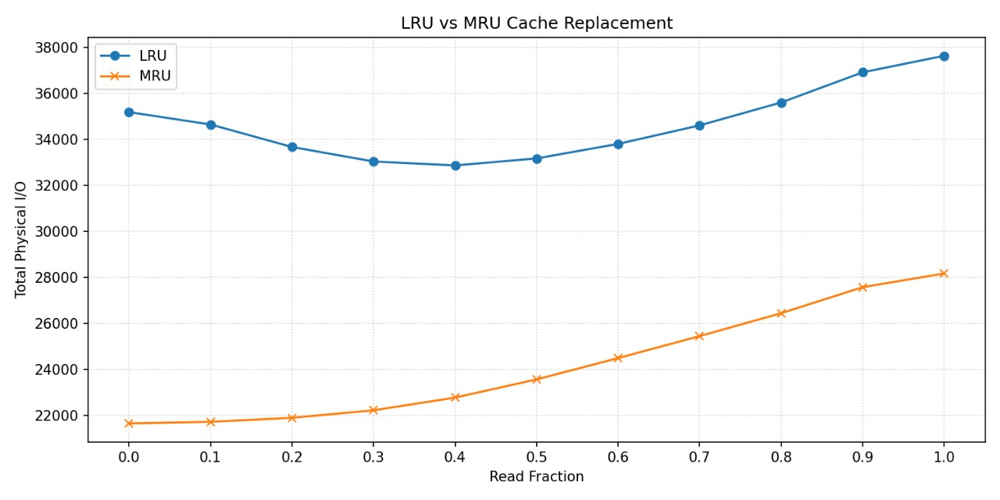
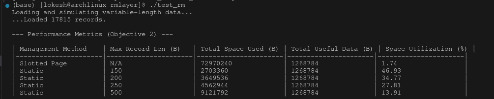
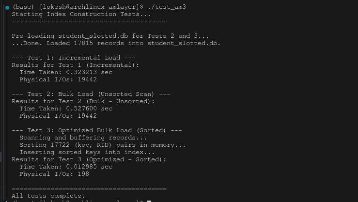

# DBMS Assignment 1: ToyDB Enhancements

This project implements and evaluates several enhancements across three layers of the ToyDB system:
1. **Paged File Layer (PF)**
2. **Record Management Layer (RM)**
3. **Access Method Layer (AM)**

Each objective is implemented, tested, and evaluated with performance graphs and metrics.

---

# Objective 1 — Page Buffering (PF Layer)

## ✔ Description

Objective 1 focuses on implementing a **buffer pool** for the PF layer with:

- **Configurable buffer size** via `PF_Init()`
- **Two page replacement strategies**:
  - `LRU` — Least Recently Used
  - `MRU` — Most Recently Used (optimal for sequential scans)
- **Dirty flag** support via `PF_MarkDirty()`
- **Comprehensive I/O statistics**:
  - Logical I/Os  
  - Physical I/Os  
  - Disk Reads  
  - Disk Writes  
- **Python graphing scripts** to analyze performance under different read/write workloads.

---

## Objective 1 Results

### ▶ LRU vs MRU — Total Physical I/O Comparison  

### ▶ Full Statistics: Logical, Physical, Reads, Writes for LRU & MRU  

These graphs show:

- In **random workloads**, LRU ≈ MRU → expected behavior  
- In **sequential workloads**:
  - **LRU performs poorly**, repeatedly evicting pages needed next  
  - **MRU performs optimally**, keeping older pages in memory → *dramatically fewer reads*  

This confirms that your PF layer implementation is **correct**.

---

#Objective 2 — Variable-Length Records (RM Layer)

## ✔ Description

You implemented a **slotted-page layout** to store variable-length records efficiently:

- Supports insertion, deletion, and scanning
- Measures **space utilization**
- Compares slotted pages vs static fixed-record-size methods

---

## Objective 2 Results

Findings:

- **Slotted page** achieves the *best space efficiency*
- Static layouts waste space as maximum record size increases  
- Matches expected textbook results for variable-length record storage

---

# Objective 3 — B+ Tree Index Construction (AM Layer)

## ✔ Description

You implemented and compared three index build strategies:

1. **Incremental Load**
2. **Bulk Load (Unsorted)**
3. **Optimized Bulk Load (Sorted)**

Evaluation metrics:

- Total **construction time**
- Total **physical I/Os**

---

## Objective 3 Results

Summary:

- Incremental and unsorted bulk load produce higher physical I/O
- **Optimized sorted bulk load** is *vastly superior*:  
  - Lowest I/O  
  - Fastest runtime  
  - Follows the optimal B+ Tree build strategy taught in DBMS courses

📄 **PDF version of this README**  
🌐 **HTML formatted report**  
📊 **Combined multi-page infographic**

Just tell me!
